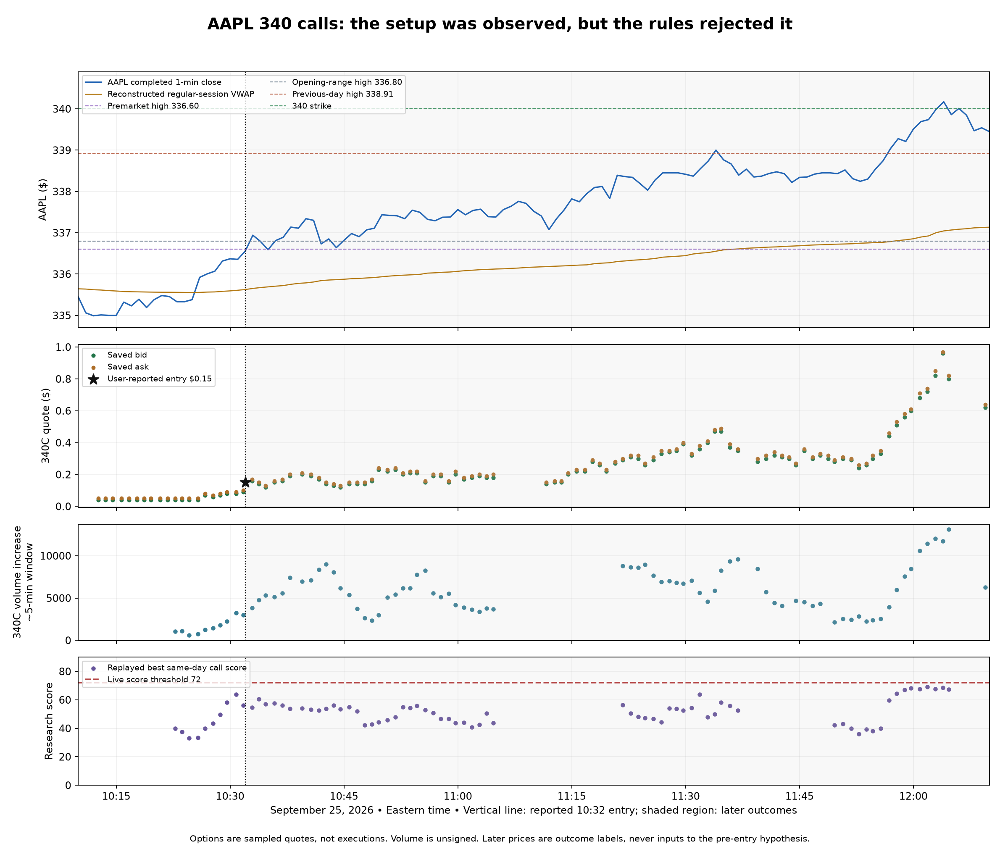

# AAPL $340 calls — September 25, 2026 reconstruction

**Finding: the scanner observed the developing move and call activity before the reported 10:32 ET entry, but its rules rejected them.** This AAPL miss was not caused by the rotating options-chain sweep. It was a mismatch between the setup being sought and the live volume, contract, score, and benchmark rules.

Case contract: `AAPL  260925C00340000`, the September 25 $340 call. Same-day expiry is the working interpretation of the user's lotto trade; the saved quotes closely match the described price progression. The reported $0.15 entry and partial sale are user observations, not brokerage executions independently verified here.

**Evidence and reproduction.** The archived Railway database supplied 160 stock observations, 143 chain-coverage records, 141 full option snapshots, and 141 decisions from 09:30–12:10 ET. The export was reconstructed with SHA-256 verification (`9a3c648cf0d9648b1783aa0a17721da5b2bdc3e1fd659d25a542ad50b2120adc`). Replaying the saved inputs with the deployed thresholds reproduced all 99 scored decisions in the export to the recorded two-decimal precision. The remaining decisions were unscored. Schwab historical minute bars, extended-hours bars, and completed daily bars were retrieved separately on September 26. Live observations and later historical bars can differ slightly due to revisions and timing; the actual rejection analysis uses saved live observations.

**What was visible before the entry.**

| Time ET | Price / structure | Same-day call evidence | Saved $340 call bid / ask |
|---|---|---|---|
| 10:25:44 | Stock $335.645; recovery beginning near VWAP | $340-call cumulative volume 27,258; delta 0.044 | $0.04 / $0.05 |
| 10:28:40 | Stock $336.34; live code recognized a reversal | Four active neighboring strikes; comparable call-volume rate 2.10× prior window | $0.07 / $0.08 |
| 10:29:35 | Stock $336.417; four of last five completed closes above their contemporaneous VWAPs | Same-day call-volume increase 10,088; rate 2.95× prior window | $0.08 / $0.09 |
| 10:30:46 | Stock $336.545; all five completed closes above VWAP; rising local stock volume | Five active neighboring strikes; call-volume increase 14,071; rate 3.92× prior window | $0.08 / $0.09 |
| 10:32:55 | Stock quote $336.72; above the verified premarket high | Five active neighboring strikes; call-volume increase 16,518; rate 2.57× prior window | $0.16 / $0.17 |
| 10:33:47 | Stock $336.85; completed breakout bar now available | Same-day call-volume increase 18,459; $340 delta 0.124 | $0.14 / $0.15 |

These volume changes refer to cumulative contract counters between sampled observations, with the scanner's approximately five-minute endpoints and duration-normalized acceleration. They are not premium dollars, signed buying, opening transactions, or evidence of a known institution's intent.

For the **specific $340 call**, the latest approximately five-minute increase at 10:32:55 was **3,823 contracts**, versus **1,453** in the preceding comparison window: **2.56×** the prior rate after adjusting for actual interval lengths. Total volume was **32,255**, open interest **18,038**, and the quoted spread was **one cent / 5.88% of ask**. The quote itself was current. The underlying quote was timestamped 10:32:24; the chain arrived at 10:32:55. These are sampled, imperfectly synchronized observations, not tick-by-tick reconstruction of the user's fill.

**Chart levels and sequence.**

- Previous close: **$335.92**. Regular-session open: **$336.04**.
- Schwab premarket high from 04:00–09:29 ET: **$336.6042**, close to the approximately $336.50 level reported by the user.
- First ten-minute / opening-range high: **$336.80**. The opening minute had already crossed the premarket high and failed; the next minute fell as low as **$334.53**. A premarket-high touch alone therefore was not enough even on this day.
- VWAP recovery strengthened through 10:26–10:30. At 10:29, the completed-bar directional efficiency was about **0.79**, and the latest five-minute stock volume was about **1.45×** the preceding five minutes.
- The **10:32–10:33 bar** crossed both the premarket high and the $336.80 opening high. Its full OHLC cannot be used before 10:33; the saved live stock quote already showed a premarket-high break by the 10:32:55 observation.
- Yesterday's high was **$338.91** and was first exceeded in the **11:33 minute**, approximately an hour after entry. This was a later continuation milestone, not a prerequisite observable at entry.
- The stock first exceeded the **$340 strike in the 12:02 minute**. The saved option quote at 12:03:51 was $0.96 / $0.97. Those later values are outcome observations only. They neither prove the user's exact fills nor establish an entry signal.

Using only completed daily bars through September 24, reconstructed **21-day Wilder ATR was $7.195**; the 21-day simple average was $7.253. The user's $7.21 is close, with differences possible from feed and smoothing settings. TradingView's default ATR uses RMA/Wilder-style smoothing, with other smoothing choices available ([TradingView ATR documentation](https://www.tradingview.com/support/solutions/43000501823-average-true-range-atr/)). The live scanner used a 14-session simple true-range average instead.

At the saved $336.72 stock quote, the $340 strike was **$3.28 away, about 0.46 of prior ATR21**. Yesterday's high remained an intervening level, $2.19 away. ATR provides a scale for those distances; it does not promise that the remaining distance will be traveled or define a fixed daily movement allowance.

**The exact reasons an alert did not go out.**

| Rule | Live setting | Evidence at 10:32:55 | Effect |
|---|---|---|---|
| Historical stock-volume gate | Cumulative pace ≥2.0×, or local historical RVOL ≥1.5× plus acceleration/range checks | Pace **0.5195×**; local historical RVOL **0.4831×** | Hard rejection, despite volume improving against the immediately preceding interval |
| Score | At least **72** | Best same-day call scored **54.64**; highest candidate across expiries scored **56.55** | Hard rejection; the 10:30 same-day candidate had also failed at **63.70** |
| Benchmark confirmation | Positive benchmark, or sufficient relative leadership | AAPL completed-bar five-minute return **+0.1637%** versus QQQ **−0.0256%**; relative edge **+0.1893%** | Failed the non-peer leadership cutoff of **0.20%**; roughly 1.07 basis points short |
| Target-contract delta | Minimum **0.12** | $340-call delta **0.114** | Exact contract excluded at this observation |
| Early contract price | Minimum ask **$0.15** | Ask was **$0.09** at 10:29 and 10:30 | Exact contract excluded during the pre-breakout build |
| Known-level context | No explicit premarket-high or previous-day-high fields | Both levels mattered to the trade thesis | Could recognize a generic reversal, but could not evaluate this level-based setup explicitly |

The context failure was not absence of relative strength: the observed stock was outperforming a slightly negative QQQ. It was a hard threshold falling just above the measured difference. AAPL also has no dedicated peer group in the current semiconductor-heavy mapping.

At 10:33:47 the $340 call passed the current delta and ask filters, yet the same-day candidate still scored only **60.53** and failed stock-volume requirements. Lowering delta alone would not fix this miss. Lowering score alone would not fix the hard volume gate either. The three-observation persistence rule was downstream of these failures, so it was not the primary cause here.

The live contract selector also favored the **$337.50 calls** or a later expiration because of its liquidity/delta ranking. Recognizing a stock idea and selecting the exact inexpensive $340 lotto contract are separate problems.

**A testable setup derived from this case.**

The coherent sequence was **VWAP recovery → sustained acceptance and improving local volume → expanding multi-strike call activity → approach to a known premarket/range boundary → break of that boundary, with a plausible strike distance measured against prior ATR**. The pre-entry watcher should describe that developing sequence rather than require the eventual previous-day-high break or unusually high whole-day stock volume.

An offline hypothesis was added to the reproduction script. It requires price above open, previous close, and VWAP; at least four of five completed closes above VWAP; positive five-minute price movement with efficiency ≥0.55; stock volume ≥1.2× the immediately preceding five-minute interval; three or more active same-day call strikes and options acceleration ≥1.5×; positive relative strength; price within 0.1 ATR21 of the known premarket high; and a chosen OTM strike no farther than 0.6 ATR21. The experimental early-contract band is ask $0.05–$2.50 and delta 0.05–0.55, while retaining the live fresh-quote and spread limits. These numeric choices are **hypotheses from a selected winning example**, not calibrated production parameters.

Using only observations available at each timestamp, this hypothesis first recognized:

- **WATCH at 10:29:35 ET**, with the $340 call quoted $0.08 / $0.09, roughly 2½ minutes before the reported entry minute.
- **TRIGGER at 10:32:55 ET**, after the stored stock quote exceeded the premarket high, with the call quoted $0.16 / $0.17. This is within the reported entry minute but cannot establish a signal preceding the user's exact fill.

This counterfactual evaluates a setup detector, not the existing Discord confirmation, cooldown, ranking, or daily-budget pipeline. It therefore does not claim those alerts would have been delivered at these timestamps. The supplied quote also does not guarantee an obtainable fill.

**What should be changed next, and what remains unproven.** The supported design change is a separately evaluated early level-reclaim setup with relative/local stock-volume improvement, explicit premarket and prior-day levels, ATR-normalized distance, and a lotto-specific contract selection path. Its inputs and individual rejection reasons should be stored separately from a single aggregate score. A strong benchmark can add evidence; a barely negative QQQ should be assessed alongside measured stock leadership rather than dominate through a narrow cutoff.

Before promoting that setup into live alerts, freeze these rules and test them on unseen days and names, including failed VWAP recoveries and failed premarket breaks. Evaluate price and executable-quote proxies at 5/15/30/60 minutes, adverse excursion, spread and slippage assumptions, late signals, and actual alert volume. Ending near the session high is a future label, never an input. This selected example demonstrates that a pre-entry pattern was observable and identifies why the current rules blocked it; it does not establish predictive probability or a repeatable 500% return edge.

Live thresholds were not changed during this investigation. Only archived-data diagnostics were deployed; the temporary export setting was disabled after retrieval. The raw observations remain local in the ignored research directory and on the existing persistent volume. This report does not yet establish the separate causes of the reported SPY, MSFT, or BE misses.

Reproduction: `scripts/reconstruct_aapl_20260925.py`; derived observations and hypothesis states: [analysis.json](analysis.json); printable chart: [reconstruction.pdf](reconstruction.pdf). The script verifies the saved scores before plotting.
