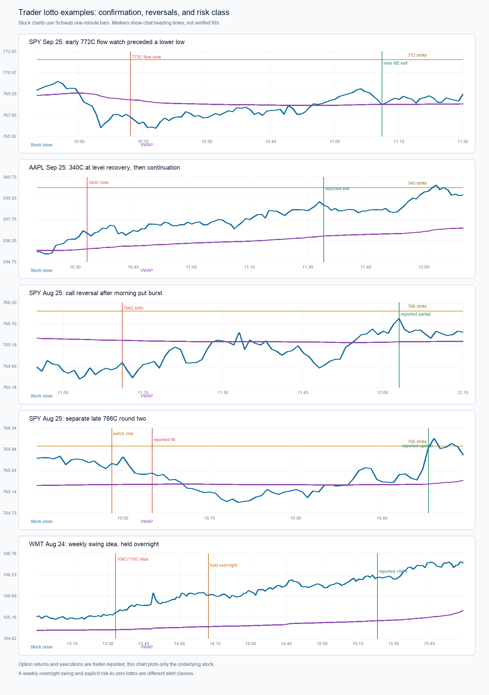

# Additional trader callouts: July 29–August 13 and September 16–25

This continues [the prior chart review](trader-trade-log-review-2026-10-01.md). Each heading time is treated as a **watch/callout time**, not necessarily a fill. Nested replies have no exact timestamps. Reported option prices are the trader's account, not independently verified executions. A quoted move from one premium to another is not a whole-position realized return, especially where the trader sold in pieces.

Read-only Schwab one-minute stock archives cover **SPY August 12–13** and the September symbols below. A fresh request for July 29–August 13 minute bars returned empty for every requested symbol as of October 1. The older July/early-August stock charts, SMCI August 12–13, and the August 12 symbol typed `SPCX` therefore **cannot be verified from this feed**. Both `SPCX` and plausible `SPXC` returned empty for the old session; the spelling remains unresolved. Empty history is not evidence that a trade did not occur. The saved sources used here include `data/research/2026-09-22/SPY.json`, `data/research/2026-09-25/{SPY,AAPL,MSFT}.json`, and `data/research/2026-10-01/{SPY,NVDA,TSLA,MU,AMZN}.json`.

## Earlier examples: classify the trade, preserve the chart limit

| Date / call | Trader-reported progression | Reliable label |
| --- | --- | --- |
| **Aug 13, 9:45 SPY 776C** | Fill $1.08 → $1.48 → $1.72 → $2.12 partial → $2.38 final (**+120%** first-to-last quote). | **Chart verified.** At the heading, the last completed SPY close was **$775.71**, just above VWAP near $775.52, with high so far $776.47. By 10:00 the prior completed close was $777.61; session high was $779.37. Opening continuation close to the chosen strike. Intermediate option-update times and fills remain unverified. |
| **Aug 13, 10:08 SMCI 40C** | $1.04, stop $0.82 → $1.20/$1.42 → out $1.70 (**+63% quoted**). | Managed winning call by the trader log; **SMCI chart unavailable** for this day. |
| **Aug 12, 10:02 `SPCX` 145C** | $1.45 → reported sale fill $2.06 (**+42% quoted**). | **Ticker and chart unresolved.** Do not silently relabel as SPXC or use for chart-feature training. |
| **Aug 12, 9:35/9:43 SMCI 37C** | First call $1.07 → $1.55 (**+45% quoted**); explicit “round 2” around $0.90, with later $1.20/$1.32 (**up to +47% quoted** if the latter belongs to round two). | Two trade legs, not one continuous return; exact message order and chart unavailable. |
| **Aug 5, 10:54 and 11:50 SPY 771P** | First: $1.10, stop $0.90, later $1.50 (**+36% quoted**) with spot invalidation above $774. Second: $1.40, stop $1.22, later $1.80 (**+29% quoted**). | Two separate put opportunities. No August 5 minute chart remains to test their triggers. |
| **Aug 5, 9:32 NVDA 220C; 10:02 NVDA 222.50C** | 220C $1.16, stop $0.85 → $2.63 (**+127% quoted**). Later 222.50C $0.74, stop $0.50 → $1.18 partial (**+59% quoted**). | Different strikes and decision times; chart unavailable. Strike comparison needs same-time option quotes to be fair. |
| **Aug 4, 9:36 SPY 763C** | About $1.05 → $2.98 (**+184% quoted**). | Trader described a pullback into premarket high; that level and reclaim **cannot be chart-verified** here. |
| **Aug 3, 9:57 SPY 754C; 9:34 AMZN 290C** | SPY $0.68 → $1.14 (**+68% quoted**). AMZN $0.80 → $1.37 (**+71% quoted**). | Early calls, but no available August 3 minute bars to classify opening drive versus recovery. |
| **Jul 31, 9:52 AMZN 275C** | $0.58 → $0.83 (**+43% quoted**). | Chart and expiration unavailable. |
| **Jul 29, 12:59 GOOGL 340C idea; 9:45 AAPL 345C** | GOOGL later described as +100%, without a stated fill. AAPL $0.60 → $0.99 (**+65% quoted**) followed by a separate “100%” update. | The GOOGL item is an **idea**, not a verified entry. AAPL's later 100% remark has no price/timestamp; it must not be equated with $0.99. Both charts unavailable. |

## September: match each callout to the chart at decision time

The stock values here use the most recent **completed** one-minute bar at each heading. VWAP is reconstructed from completed regular-session bars. Later highs/lows are outcomes, never available to the scanner at the heading.

| Callout | What the stock showed then | What followed; correct label |
| --- | --- | --- |
| **Sep 25, 10:12 SPY 772C “following a whale,” $0.18** | SPY **$767.66**, **below** VWAP ~$768.85, about $4.34 from the chosen strike. Morning high was $770.31. In the next 30 minutes it made a **new low at $766.29**. | The trader later quoted $0.29/$0.30 (up to **+67% quoted**) but says the position finished **near breakeven by 11:11**. At 11:02 SPY was $769.10 and above VWAP; at 11:11 it was near $768.77. “Whale” is an unverified flow observation, not proof of opening bullish buying. SPY later reached $772.28, but the later move cannot be assigned to a held 10:12 position that was closed. This is the key **non-runner** alongside same-day winners. |
| **Sep 25, 10:33 AAPL 340C, $0.17** | AAPL **$336.94**, above VWAP ~$335.65 and near its then-high $336.99. The [dedicated reconstruction](aapl-2026-09-25/reconstruction.md) shows live VWAP recovery, break of premarket/opening levels, multi-strike call-volume acceleration, and a saved $0.16/$0.17 quote at 10:32:55. | Half sold after a reported 100% move; remainder around $0.44 (**+159% first-to-last quoted premium**). A later $1.00 quote would be **+488% from $0.17 after exit**, **not a realized gain**. This is stock/level/chain confluence, unlike the early SPY 772C. |
| **Sep 25, 9:39 MSFT 520C, $0.58** | MSFT **$511.00**, well above VWAP ~$506.83 after rising from the $497.25 opening low. | It reached $517.48 by 9:55, still short of 520. Trader reports 100% by 9:47 and sale by 9:54; no saved 520C tape or exact exit premium. This fast opening drive is distinct from the later 510C/515C calls on the same day. |
| **Sep 24, 10:39 SPY 763P, $0.35** | SPY **$765.99**, still above VWAP ~$765.19; the $763 strike was below spot. By 10:55 it was **$764.88**, below VWAP; eventual day low $763.245. | $0.56 is **+60% quoted**; a separate “100%” message is unpriced. The **11:36 SPY 766C** in the earlier batch arose after a new low and became a later reversal/reclaim trade. Record bearish and bullish states separately; do not let the eventual call win rewrite the earlier put signal. |
| **Sep 21, 11:42 SPY 771C, $0.45** | SPY **$770.46**, above VWAP ~$768.31 and near its then-high $770.56. | Next 30-minute high $771.85, session high $774.89, close $773.52. $0.79 is **+76% quoted**; a later “100%” comment has no exact premium. Near-high continuation rather than a pullback. |
| **Sep 21, 9:38 MU 1090C, $0.63** | MU **$1,052.45**, above VWAP ~$1,046.01; 1090 was about **3.6% out of the money**. | MU reached $1,064.49 within 30 minutes but never reached 1090, then closed near $1,043.315. Trader reported the contract doubled. This is a **morning scalp, not an end-of-day close near high**. Expired option quotes are needed to determine spread and premium path. |
| **Sep 16, 3:08 SPY 751P, $0.55** | SPY **$754.01**, far below VWAP ~$758.73, after the earlier conditional $758 and $756 put legs. | It reached $749.60 by 3:27 then rebounded to close $754.10. The quoted $1.47 exit is **+167%** from $0.55, whereas “200%” is approximate or refers to a different lot/price. This is a **third late downside leg**, not proof of closing at the low. At 3:19, **AMZN 245P** was only an *idea*: AMZN was ~$245.03, later touched $244.30, and closed $245.84. |
| **Sep 16, 9:56 NVDA 217.50C; 10:17 TSLA 372.50C** | NVDA **$214.81**, above VWAP ~$214.11, later high $216.76 and close $213.89. TSLA **$363.42**, above VWAP ~$359.95, later high $365.10 and close $358.13. | NVDA's entry is written “$30”; it **may** mean $0.30 but cannot be silently converted. Trader later described 100%. TSLA has $0.40 entry with **no outcome/exit**. Both stocks faded by close, separating early option opportunity from an end-of-day trend prediction. |

The strongest matched-day lesson is **September 25**: large or “whale” option flow can put a contract on watch, but it did not make the early SPY 772C a confirmed winner. AAPL had saved evidence of improving price and multi-strike call activity at a nearby level; early SPY was below VWAP, distant from its strike, and made a lower low. These selected cases suggest testing *flow + stock confirmation + strike reachability + quote quality* against flow-only watches. They do **not** justify a fixed cutoff or establish a hit rate. September 24 shows the scanner must allow an independent reversal setup after a prior directional trade. The September 16 and 21 early/late cases show that **100% option scalp** and **stock closes near session extreme** are different targets.

For a genuine learning test, keep every watch and failed alert with its timestamp and rule outcome, then acquire synchronized 0/1-day option bid/ask histories or begin collecting them prospectively. Freeze candidate rules before evaluating later unseen sessions, include spread/slippage and adverse excursion, and report idea-to-alert latency and alerts per day. These examples guide what to test; they are not a calibrated backtest or a reason to change the live scanner yet.

## Additional July 13–September 3 lotto examples

This later batch includes a **different risk class**: several messages explicitly say “risk to zero,” “complete lotto,” “50/50,” or “not high quality.” They show what *could* move sharply, but the high-quality alert objective should not inherit the trader's willingness to take a speculative flyer. Expiration is missing for many; a strike and a cheap premium alone do not establish 0- or 1-day eligibility. “$25,” “$38,” “$130,” and “$100” appear to be **per-contract dollar shorthand** in context but are preserved as written because their decimal option quotes are not verified.

The saved Schwab stock bars support the **September 3 SPY, August 24–27 SPY/GOOGL/WMT, and August 17 GOOG/GOOGL** observations below. They do not reach August 14 or earlier for the other symbols. No synchronized historical option tapes were found for these callouts. The trader wrote “Google,” so the share class is unconfirmed; GOOGL is used for the August 24 chart illustration, and **both** share classes are checked for the August 17 contradiction.

| Callout | Stock-chart evidence at heading | Option/result label and implication |
| --- | --- | --- |
| **Sep 3, 3:42 p.m. SPY 773P at $0.22** | Last completed SPY close **$773.30**, above VWAP ~$771.36, after day high $774.03. From the heading to 4:00 the low was $772.69; last regular-session close $773.16. | The trader explicitly risked the premium to zero and reported “100%” at **4:01 p.m.**, without an option quote. The underlying only dipped modestly; a near-expiry option can have a nonlinear response, but this particular result **cannot be independently verified** from the stock bar or from a quote after the regular-session close. It is a speculative **late-day fade**, not evidence the stock closed at the low. |
| **Aug 27, 12:03 p.m. SPY 772C at $0.38** | SPY **$770.78**, above VWAP ~$769.24 and below earlier high $771.10. By the 12:41 heading the prior completed close was **$771.59**; the day later reached $772.355. | $0.60 is **+58% quoted**. “Treat as lotto” and “risk 75%” belong in the risk label. This is a later, farther-strike entry than the **11:48 769C/770C** choice documented in the prior report. Same day, different risk/reward. |
| **Aug 25, 11:11 a.m. SPY 766C at $0.30** | SPY **$764.65**, below VWAP ~$765.31 after the earlier put collapse to $763.05. By 12:03 the prior close was **$765.69**, above VWAP, showing a reversal attempt. | Trader set a wide $0.15 stop, said “50/50,” and described a transient $0.60 quote, suggested $0.54 take-profit, then reported selling two-thirds around a 100% move. At the watch, price **had not yet reclaimed VWAP**. Log both the early idea and later confirmation; this was a speculative direction reversal after the morning put, not a preconfirmed high-quality call. |
| **Aug 25, 2:58 watch / 3:05 p.m. SPY 766C round two at $0.17–$0.18** | At 2:58 SPY **$765.57**, above VWAP ~$765.27 but in a narrow late-day range. At 3:05 it was **$765.47**. At 3:53 it was ~$765.56; the following minutes briefly reached $766.22, while final close was $765.83. | Trader explicitly said **no entry yet** at 2:58, then called the filled $0.18 entry a **low-quality, risk-to-zero** lotto. $0.18→$0.25 is only **+39%**; the later “100%” partial sale has no price/timestamp. This is a second SPY call leg, not a continuation of the 11:11 position. The narrow stock range and dependence on late option repricing deserve a separate validation cohort. |
| **Aug 24, 1:33 p.m. WMT 108C / 110C weekly swing** | WMT **$105.21**, above VWAP ~$104.84. By 2:12 it was ~$105.72; by 3:23 ~$106.14, near its high then. It closed **$106.53**, near the $106.595 day high but still short of 108. | Trader reported $0.33 for 108C, about +50% by 3:23, and a simultaneous 110C without its price. **Held overnight as a weekly swing.** This is useful evidence for sector/rotation and trend persistence, but should be **excluded from 0/1-day intraday-alert outcome metrics** unless its actual expiration meets that scope. Overnight gap risk and a different horizon cannot be mixed with same-day scalps. |
| **Aug 24, 9:50 a.m. GOOGL 352.50C at $0.21** | GOOGL **$347.12**, above VWAP ~$346.01. At 10:48 it was ~$349.88, near the high then $349.95; final day high $351.60, below the strike. | $0.46 is **+119% quoted** despite the underlying not touching 352.50. The trader mentioned a new $0.15 stop and possible $0.35 sale versus holding; **no final realized exit is supplied**. This is an opening-drive/near-high call with unverified option path. |
| **Aug 17, 10:37 a.m. “Google” 340C at $0.13; 10:53 $0.28** | Saved GOOGL bars show **$343.18** at the first heading and **$342.16** at the second, both above 340 and falling below VWAP. GOOG, the other share class, was **$340.88** at the first heading and ~$339.83 at the second. | This is an **inconsistency to resolve before training**: even the lower-priced GOOG 340 call would have at least ~$0.88 intrinsic value at the first heading, greater than the reported $0.13. GOOGL would have more than $3. Possible typo, different strike/class, adjustment, or mismatched feed/date; we cannot choose among them. The reported “100%” is not a validated 340C example. |
| **Aug 14, 10:00 a.m. AAOI 160C at $0.40** | No accessible August 14 AAOI minute bars. | Trader reported 100% by 10:12 and $1.00 by 10:37 (**+150% first-to-last quoted**). Strong candidate for an opening-drive study **once chart and option data exist**, not verified here. |
| **Aug 12, 9:50 a.m. AMZN 267.50C at $0.19** | August 12 AMZN minute chart unavailable. | $0.58 by 10:03 is **+205% quoted**. Fast early lotto; exact execution and option spread unverified. |
| **Aug 10, 11:00 a.m. NVDA 217.50P “$25”** | August 10 NVDA minute chart unavailable. | Trader reported $1.12 and “300%” by 12:41. If “$25” means **$25 per contract / $0.25 premium**, $0.25→$1.12 is **+348%**, not exactly 300%; do not assume that conversion as a verified fill. Explicit **risk-to-zero** label. |
| **Aug 4, 10:43 a.m. SPY 768C at $0.40** | August 4 SPY minute chart unavailable. | $0.66 by 11:02 (**+65% quoted**) and $1.10 by 11:25 (**+175% quoted**). A separate later strike from the **9:36 763C** on the same day; it should be a separate candidate. |
| **Aug 3, 10:10 a.m. NVDA 207.50C “$38”** | August 3 NVDA minute chart unavailable. | Later $0.63 and $1.10 by 3:02. If “$38” means $0.38, first-to-last would be **+189%**; no realized exit is stated. The long holding window differs from a quick morning scalp. |
| **Jul 27, 10:15 a.m. AAPL 340C at $0.36** | July 27 AAPL minute chart unavailable. | Reported $1.00 by 11:01 (**+178% quoted**), with no sale or expiry recorded. |
| **Jul 23, 11:35 a.m. SPY 740C around $0.50** | July 23 SPY minute chart unavailable. | Trader set a 50% stop ~$0.25 and said not to size up. Around 12:12 the calls were reportedly near +80% at VWAP, then +100% at 12:23. Same-day put-to-call reversal is described but the earlier put's contract/time is missing. No exact exit. |
| **Jul 20, 2:28 p.m. AAPL 327.50C watch “$26”** | July 20 AAPL minute chart unavailable. | Explicitly **“no alert”**; later reported $0.70 then $1.25. If “$26” means $0.26, the latter is **+381% hypothetical after-watch**, not an alerted or executed return. A separate 330C “100% back from the dead” message lacks entry/price. This is a missed-watch example, not an alerted winner. |
| **Jul 20, 11:43 a.m. MSFT 402.50C “$24”** | July 20 MSFT minute chart unavailable. | Reported +100%, then +200%, later “$1.00”; if the opening shorthand means $0.24, the latter is **+317% quoted**. “Sell into 402” is a trader exit thesis, but the stock level cannot be checked. Explicit risk-to-zero. |
| **Jul 16, 3:35 p.m. SPY 750C “$20”; 3:51 update** | July 16 SPY minute chart unavailable. | A likely $0.20 ticket was reportedly sold at $0.45 (**+125% if same contract**). Later $0.78 and “300%” were **after the trader says they exited**; a 4:00 “$100” remark is ambiguous. Keep sale versus later peak separate. Ultra-late, risk-to-zero case. |
| **Jul 15, 9:32 a.m. AMZN 255C watch “$60”; 10:02 AAPL 325C at $0.35** | July 15 minute charts unavailable. | AMZN has no confirmed entry or result. AAPL later described as 100%, “$130” per contract, and $1.80 at 10:18; if $1.30 is the meaning, $0.35→$1.80 is **+414% first-to-last quoted**, not a verified realized gain. Keep AMZN watch and AAPL trade distinct. |
| **Jul 13, 3:23 p.m. SPY 748P at $0.20** | July 13 SPY minute chart unavailable. | Reported $0.42 later (**+110% quoted**); 748 support was the trader's stated level. “Complete lotto” and no exact update/exit time. |

The **Aug 17 GOOGL contradiction** is a concrete data-quality stop sign: no learning pipeline should convert every Discord line into a positive sample. The **Aug 25 SPY** entries show the opposite problem: several real option gains were intentionally low-conviction, wide-stop trades and must not be passed off as the scanner's target of a few high-quality alerts. For research, retain a *candidate type* (`conditional watch`, `confirmed setup`, `risk-to-zero speculation`, `weekly swing`), the *actual alert/entry state*, the *contract's expiration*, and separate *first favorable quote*, *realized exit*, and *later peak* labels. Then compare the scanner's alertable subset with both winning and failed candidates on unseen days.
