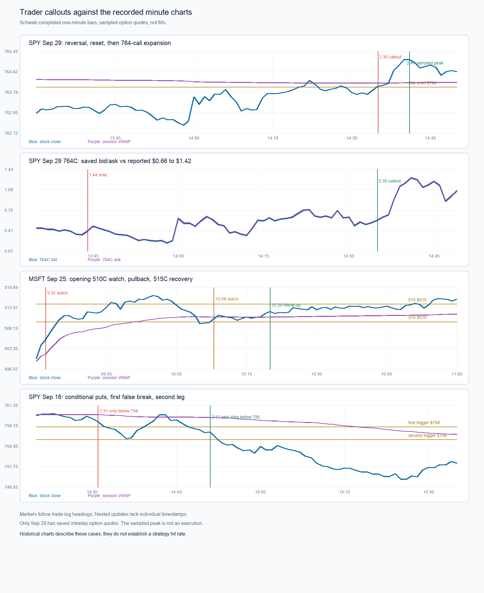
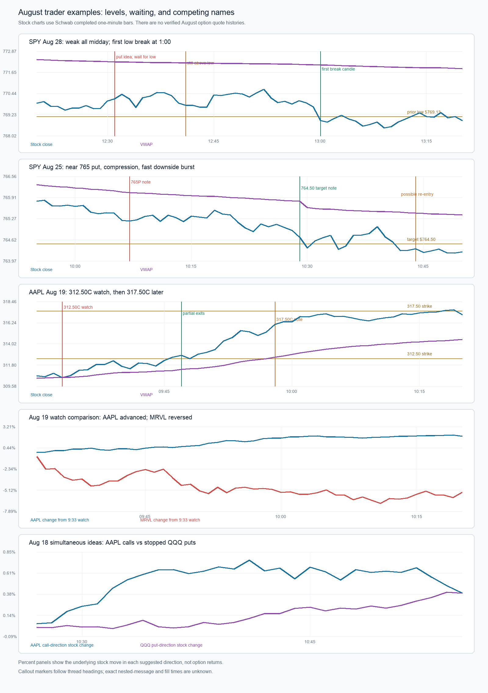

# Trader callouts matched to the charts

[The companion review](trader-trade-log-extra-2026-10-01.md) covers the additional July 13–August 13 and September callouts, including the low-conviction late-day lotto examples.

The user supplied dated chat callouts from August 31 through September 29, 2026. This review aligns the **heading timestamp** of each callout with Schwab's regular-session one-minute stock bars. Nested updates have no individual timestamps, so their exact entry and exit minutes are unknown. A heading timestamp is not assumed to be an execution time. Stock values described as visible at a heading use the most recent **completed** minute candle, which avoids treating a future candle as known. The full-session path and option outcomes are reported separately.

User-reported premium updates describe their trade log. They are not independently verified fills. The September 29 SPY case also has saved scanner option snapshots, which are identified explicitly. Earlier expired-contract intraday quotes are not available in the saved files. The repeated September 17 INTC message is counted once; the September 11 message lacks a ticker and cannot be assigned to a contract.

Chart source files: `data/research/2026-10-01/SPY.json`, `MSFT.json` in `data/research/2026-09-25/`, `QCOM.json`, `TSLA.json`, `INTC.json`, `NVDA.json`, and `AAPL.json` in `data/research/2026-09-29/`. Each response includes the earlier named dates. The direct SPY option snapshots and decisions are in `data/research/2026-09-29/SPY-scanner-export.json`.

## What the calls looked like when they were made

| Callout | Stock chart available at the heading | Subsequent chart and trade-log evidence |
| --- | --- | --- |
| **SPY Sep 29, 2:35 p.m. calls, 764C** | SPY was near $763.88 after a 1:58 p.m. low around $762.39, a sharp 2:00 reversal, and a pullback/rebuild into 2:30. It was still near the $764 strike. | The 764 call's saved 2:35 quote was $0.58/$0.59; by 2:41, it was $1.29/$1.30 with SPY $765.29. The user's sequence reports a $0.66 call entry, $0.44 stop, and sale at $1.42: **about +115% from that reported entry**. The sampled quote path does not prove the exact fill or $1.42 exit. |
| **MSFT Sep 25, 9:32 a.m. 510C watch** | The 9:31 completed close was $503.329. MSFT had opened $498.74, traded as low as $497.25, and was already driving higher with the 510 strike still above spot. | MSFT reached about $517.48 by 9:55. The log reports 510 calls around $1.00 and later $3.10 (**+210% quoted progression**). This is the early momentum family, distinct from the later pullback trade. |
| **MSFT Sep 25, 10:08 a.m. 515C watch; 10:20 follow-up** | By 10:08, MSFT was around $509.76 after the $517.48 high and a pullback to $509.06. The completed-bar VWAP was near $511.31: the stock was temporarily below it. At 10:20, MSFT was around $512.25, back above VWAP. | The first strong reclaim closed around $511.835 at 10:09. The stock later closed the 10:55 candle around $516.105. The log reports a 515 call around $0.85 and a later $3.00 (**+253% quoted progression**, if the same contract). The exact option path and timing are not independently captured. This is an opening-impulse/premium-reset/resumption case. |
| **QCOM Sep 25, 9:45 a.m. 202.50 call idea** | QCOM was near $200.155 after opening $195.03 and reaching a high near $200.74. The callout was an **idea**, with the suggested strike still above spot. | The stock briefly faded toward $198.70 by 10:21, reclaimed $200 at 10:23, reached $205.30 by 11:25, and later hit $205.85. The early callout and later reclaim are separate possible entries with different risk and premium. No contract price was supplied. |
| **SPY Sep 25, 10:52 a.m. 770C idea** | SPY was near $767.67, below then-current VWAP around $768.39; $770 was a future target area. | The stock later reached $772.28 and closed $771.30. The log gives $0.65 near this idea, but not a timestamped contract path. This is a candidate before a reclaim, not evidence that a call setup was already confirmed at 10:52. |
| **SPY Sep 24, 11:36 a.m. 766C** | SPY was near $763.73, below VWAP around $764.84 and below the 766 strike. The reported entry was $0.37 with a $0.25 hard stop. | By 12:16, SPY was near $765.88 and above VWAP near $764.75; it later reached $768.95. The reported contract reached $2.50 (**about +576% from $0.37**, assuming the same series and an executable exit). This case needs a price-led watch before VWAP reclaim and a separate triggered entry after reclaim. The option path is not independently captured. |
| **SPY Sep 23, 9:43 a.m. 772P and around 10:00 round two** | At 9:43, SPY was near $771.95, below VWAP near $772.45. At 10:00, it was near $770.68, below VWAP near $771.69. | SPY reached roughly $768.37 by 10:26. The log records put premiums $0.95, $1.30, and $1.60, followed by an exit and another 772P scalp. The first bearish setup and re-entry should be labeled separately; the message timing is too coarse to attribute the premiums to exact minutes. |
| **TSLA Sep 21, 9:35 a.m. watch; 9:50 380C** | TSLA was near $373.69 at 9:35 and near $375.14 at 9:50, above VWAP near $374.58 by the second callout. The 380 strike was out of the money. | The stock's session high was $378.36; it never needed to touch $380 for the option to rise. The log quotes $1.11 to $1.58 (**+42% quoted progression**). This argues for testing reachable premium response rather than requiring the underlying to cross the strike. |
| **INTC Sep 17, 9:50 a.m. 110C** | INTC was near $106.72, above VWAP around $105.98. It had traded to about $107.05 by then. | Over the next ten minutes the stock moved up about 2.3% and later reached a session high of $111.37. The log reports $0.86 entry, $0.67 stop, and sales near $1.66 (**+93% quoted progression**). The duplicate pasted message is one example. |
| **SPY Sep 16, 2:31 p.m. conditional puts below $758; 2:51 second trigger below $756** | At 2:31, SPY was near $759.27: **the specified condition had not occurred**. Price then broke $758, bounced back over it near 2:40–2:45, fell under again around 2:50, and broke $756 around 2:53. | SPY reached $749.60 at 3:27 and closed $754.10. The user's first short and later 754P reload describe two legs. A study must count false breaks and re-arms; triggering at the 2:31 watch would use information the trader explicitly withheld. |
| **SPY Sep 14, 11:38 a.m. call idea only above $761** | The completed-bar close was near $761.10, with a high so far near $761.12 and VWAP around $759.32. The trader specified a level before committing. | The stock rose toward $762.45 by 12:19 and around $763.52 later, then faded to a $760.77 close. The log's $0.98 to $2.30+ is **at least +135% quoted progression**, though exact strike/expiry and quote times are unavailable. The afternoon fade shows why an option scalp and an end-of-day runner need different labels. |
| **AAPL Sep 10, 10:41 a.m. 325C watch** | AAPL was near $320.08, above VWAP around $319.68 but below its earlier $323.13 high. The 325 call was still out of the money. | By 10:54 it was near $321.44; the stock later reached $326.74 and closed $326.595. The reported $1.04 fill to $1.77 sale is **about +70%**, with contract timing not independently captured. This resembles a pullback/resumption thesis rather than a callout at a new high. |
| **NVDA Sep 2, 10:15 a.m. 222.50C watch** | NVDA was near $222.43, around the suggested strike and above VWAP near $220.62. | At 10:27 it was around $223.14. The trader reported closing near breakeven, yet the contract was reportedly $3.15 by 11:05, when NVDA was around $225.45. If compared mechanically with the $1.15 entry, that later quote is +174%, **not a realized trade gain**. The review needs separate labels for trade management and post-exit opportunity. |
| **AAPL Sep 1, 9:57 a.m. 325C** | AAPL was near $320.83, above VWAP near $319.12; its high so far was $321.78. | The following 30 minutes lifted the stock about 1.39%, with a high at least $325.30 by then. The log reports $1.00 to $1.57 (**+57% quoted progression**). This provides another early directional call example with an initially out-of-the-money strike. |
| **SPY Aug 31, 2:23 p.m. put idea below range low** | SPY was near $766.53. This was explicitly a **conditional idea**, including a potential fake upside breakout. | Around 2:34 SPY was near $766.15; it fell to about $765.05 at 2:43. The user reports a 100% put opportunity and exiting around 2:34; no contract/expiration or timestamped option quote was provided, so the option gain cannot be reconstructed. The price move was small, showing how time-near-expiry convexity can matter, subject to spread and fill quality. |

The September 11 snippet reports selling half at $1.60 and “100%,” but has no ticker, strike, expiration, or opening price. It stays unassigned. The QCOM 185C note appears inside the September 14, 12:55 thread; because the pasted text does not independently timestamp it, the review does not treat 12:55 as its verified entry time. QCOM was near $180.76 at that heading and its following 30 minutes were weak, which is a useful warning against assuming every call idea was immediately profitable.

## Additional August 18–28 callouts

The August 25 SPY block was pasted twice, and the August 18 QQQ/AAPL block three times. Each is counted once. Newly retrieved read-only minute histories for CRM and NFLX are in `data/research/2026-10-01/CRM.json` and `NFLX.json`; the other tickers are in the chart sources listed above. The user's option premiums remain reported observations because these dates do not have saved intraday contract snapshots.

| Callout | What was visible on the chart | What follows and how to label it |
| --- | --- | --- |
| **SPY Aug 28, 12:31 p.m. 769P idea, $0.77 reported, $0.52 stop** | The prior completed stock candle closed around $770.02, well below VWAP around $772.28 but **above the low so far at $769.13**. At the 12:41 update, SPY was still near $769.90 and the prior low had not broken. | The first recorded break below $769.13 was in the **1:00 p.m. candle**; its low was $768.84. The day low was $768.31 at 1:10. The trader explicitly waited for the low break and watched the stop. The log reports $0.91, $1.02, $1.24, and eventually about 100%; exact premium timing is not available. A line reading “11.24” sits beside a later “1.24” and is treated as ambiguous, not an $11.24 quote. This is a **conditional level break after a long weak consolidation**, not an immediate entry at 12:31. The first complete break candle was available at 1:01 to a minute-bar scanner; real-time quotes may show the crossing sooner. |
| **CRM Aug 28, 9:51 a.m. 262.50C** | CRM was near $258.45 above VWAP around $256.00, after opening from a $249 low and reaching $260.25 by then. The 262.50 strike remained out of the money. | The next ten minutes' favorable stock excursion was about +1.18%, and CRM later reached $263.53 at 11:16. The log's $1.29 to $1.90 is a **47% reported option progression**, not an independently checked fill. Early opening impulse plus reachable next strike is the hypothesis. |
| **SPY Aug 27, 11:48 a.m. 769C or 770C** | SPY was around $769.59, above VWAP near $769.16, after an earlier high of $771.10 and a morning low of $767.16. | SPY rose to roughly $770.86 by 11:55 and later $772.355 at 1:10. The trader compared 769C around $1.50/$1.36 with 770C around $0.78 and separate stops near $1.15 and $0.59. This is a useful **two-contract selection** case; the paste gives no later option exit price with which to declare one choice superior. |
| **SPY Aug 25, 10:07 a.m. 765P; 10:29 target** | SPY was around $765.22, below VWAP near $766.09, and the 765 strike was close to spot. The stock spent roughly 20 minutes around $765 before the fast leg. At the 10:29 heading, the previous completed close was around $764.91. | The 10:30 candle reached $763.05 on unusually large stock volume (513,650 shares). The first quote in the log was $0.85; the trader identified $764.50 as a target before the sharp drop. By 10:44 SPY was rebounding around $764.31 and another put entry around $1.32 was discussed; a later “769s at $2.10” may refer to another strike and must not be combined into a single-contract return. This is **weak trend → sideways compression → burst**, followed by a separate potential re-entry. |
| **AAPL Aug 19, 9:33 a.m. 312.50C watch; 9:47 updates** | At the initial watch AAPL was near $310.96 and above VWAP near $310.51. By 9:47, the prior completed close was $312.64, already through the 312.50 strike; by 9:58 it was $315.28. | The day high was $319.28 at 11:06. The log reports $1.02 on the 312.50 call, partial sales near $1.46 and $2.15, and final sale near $2.91. Comparing first and last quoted premiums yields about **+185%**, but the partial exits mean that is not a realized whole-position return. |
| **AAPL Aug 19, 9:58 a.m. 317.50C** | AAPL was around $315.28, above VWAP near $312.48. The 317.50 strike was further out of the money than the earlier 312.50 call. | AAPL traded above $317.50 later and peaked around $319.28. The log reports roughly $0.70 fill and $1.01 exit, about **+44% reported**. The two AAPL calls on the same day are a direct test of strike distance, entry timing, capital at risk, and achievable premium response. |
| **MRVL Aug 19, 9:33 a.m. calls on watch** | MRVL was near $245.00 after a rapid opening surge from a $235.84 low. The session high of $245.489 occurred around 9:33. | MRVL sank toward $228.10 by 10:11 and closed $237.35. No MRVL entry or call result was stated. This is a **watch that should not be retroactively scored as a successful long trade**. It is a valuable comparison with AAPL's simultaneous stronger follow-through. |
| **AAPL Aug 18, 10:27 a.m. 312.50C; 10:34 partials** | At 10:27 AAPL was around $309.07 and above VWAP near $308.06, with the 312.50 strike still ahead. At 10:34 it was around $310.74 and rising. | The day high was $311.49 at 10:41, short of the 312.50 strike, yet the log reports a $0.78 call moving to $1.38 (**+77% quoted**). This repeats the lesson that a call can reprice before the stock reaches its strike; premium, spread, and exit quality need contract data. The stock faded after the 10:42 exit/runner note. |
| **QQQ Aug 18, 10:27 a.m. puts; stopped out** | QQQ was around $719.90, just above VWAP near $719.52, after a bounce from earlier weakness. | The next ten minutes were roughly flat/up and the trader explicitly reports being stopped out. Around the same time the AAPL calls worked. This is a **documented loser** and a cross-name selection case: broad index weakness cannot be assumed from an earlier selloff when the index is reclaiming VWAP. |
| **NFLX Aug 18, 10:42 a.m. 79C/80C** | NFLX was about $78.59, above VWAP near $77.78. Both suggested strikes were out of the money. | The high later reached $79.0972, barely through 79 and never 80, then NFLX faded to $77.80 by the close. A later message reports selling 75% of NFLX at $1.02, but does not identify which contract it refers to; the earlier $1.00 for 79C and $0.60 for 80C must remain separate. This case tests **contract choice in a move with limited remaining stock room**. |
| **SPY Aug 18, 10:56 a.m. 767P watch/load** | SPY was around $768.04, below VWAP near $768.62 and above the 767 strike. | SPY's final low was $766.92 at 3:59 p.m. The paste supplies an $0.80 reported put entry but no exit; there is no defensible option-return label. Track as an idea with incomplete outcome. |

The August examples add two comparisons the original winner list lacked. First, **MRVL and AAPL were on watch simultaneously on August 19**, but MRVL was near an opening exhaustion high while AAPL continued through its chosen strike. Second, **QQQ puts lost while AAPL calls worked on August 18**; the system must judge the target name's own path and whether the index is confirming or conflicting at the actual decision time. A successful option trade on AAPL cannot be treated as proof that the paired QQQ put was also a sound candidate.

## What the saved scanner saw on September 29 SPY

The 764C quote was **$0.40 bid/$0.41 ask at 1:44 p.m.**, with SPY $763.12. It fell as low as a sampled **$0.20/$0.21 at 1:58**, while SPY was near $762.54. A sharp stock reversal appeared at 2:00. The option later quoted **$0.58/$0.59 at 2:35**, **$1.15/$1.16 at 2:39**, and a sampled **$1.29/$1.30 at 2:41**. These are market snapshots, not fills; the user's reported $0.66-to-$1.42 trade is a separate account. Choosing the 1:58 low ask and 2:41 high bid after seeing the entire day would be a hindsight result, not a demonstrated scanner opportunity.

The scanner did have deep snapshots throughout the period. At 1:55–1:59 its score was around 56–57, with stock-volume pace as a blocker; at 2:00 the price setup vanished under its rules during the abrupt reversal. At 2:35 it scored about 56, below the 72 cutoff and with no developing setup. At 2:41, after the option had expanded, it reached 67.5 but still failed score, stock-volume pace, and price-setup gates. The combination of a fixed score gate and requiring one of the existing setup shapes missed the trader's **reversal → pullback → second push** sequence. Simply reducing the score floor would also admit many weak candidates; this case calls for a separate, prospective pattern test.

## Research implications from the complete set

1. **Represent the trader's state transitions.** “On watch,” “only above/below,” “loaded,” and “out” are different states. A conditional watch must not become a hypothetical entry before its price condition is satisfied. Resumed momentum can be a fresh idea after a first push or fakeout.
2. **Study the clock and the whole path.** MSFT's 9:32 opening drive and 10:08 pullback recovery are two trade families on the same stock. SPY on September 16 had two downside entries separated by a failed bounce. SPY on September 29 had a first reversal around 2:00 and later expansion around 2:39.
3. **Match strike to reachable stock movement and option repricing.** An out-of-the-money call can gain materially before the stock crosses its strike, as the TSLA, AAPL, and QCOM examples invite us to test. Strike distance, delta, implied volatility, time remaining, spread, and target timing all matter. A cheap option is not automatically a good candidate.
4. **Keep separate outcome labels.** First opportunity, user's actual trade result, hypothetical peak after a watch, option outcome after an exit, and eventual stock close answer different questions. NVDA September 2 is the clearest example.
5. **Use failed and conditional instances.** The first September 16 $758 break failed before the second leg; SPY September 14 later faded, and QCOM 185C has incomplete evidence. These belong in the data beside the winners so a model does not learn only the successful screenshots.
6. **Build an actual validation set.** These user-selected examples suggest candidate structures but cannot establish hit rates. A reliable option-return study needs timestamped 0/1DTE bid/ask histories for all eligible contracts and matched non-winning intervals, then a test on later untouched sessions.

This review updates the research picture in `trader-research-plan-2026-10-01.md`. It does not alter the live scanner or claim a completed options backtest for days without contract histories.
